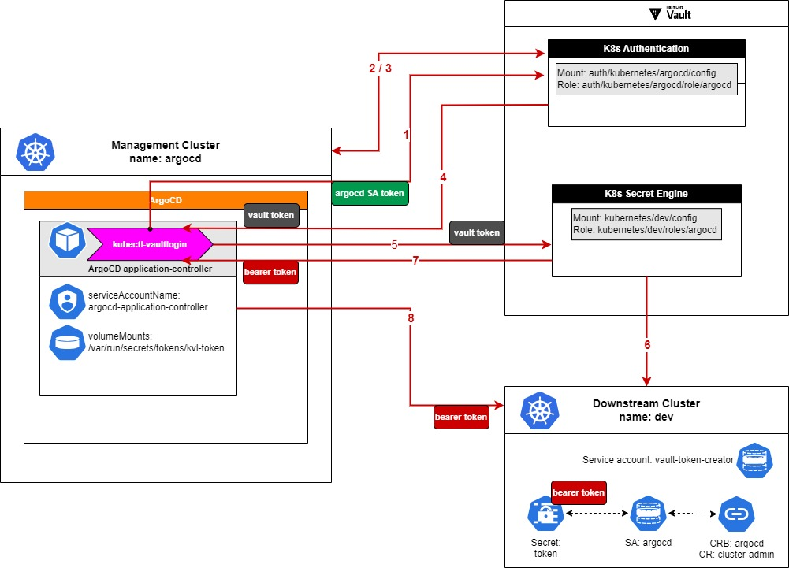

# kubectl-vaultlogin 
[](https://github.com/guardanet/kubectl-vaultlogin/actions/workflows/go-test.yml) 
[](https://goreportcard.com/report/github.com/guardanet/kubectl-vaultlogin)
[](https://api.securityscorecards.dev/projects/github.com/guardanet/kubectl-vaultlogin)
[](https://github.com/gojp/goreportcard/blob/master/LICENSE)
[](https://sonarcloud.io/summary/new_code?id=guardanet_kubectl-vaultlogin)
[](https://slsa.dev)

## Table Of Contents

-   [Overview](#Overview)
-   [Installation](#Installation)
    -   [Download From release page](#Download-From-release-page)
    -   [Verify artifacts](#Verify-artifacts)
    -   [(OPTIONAL) Install plugin locally](#(OPTIONAL)-Install-plugin-locally)
-   [SLSA3 Build Process](#SLSA3-Build-Process)
    -   [Configure your ArgoCD cluster type secret](#Configure-your-ArgoCD-cluster-type-secret)
    -   [Testing kubectl-vaultlogin plugin locally](#Testing-kubectl-vaultlogin-plugin-locally)


# Overview 
*kubectl-vaultlogin* is a kubectl client-go credential plugin that relies on Hashicorp Vault's kubernetes secret engine backend to deliver just-in-time short-lived kubernetes baerer tokens.

The need for the plugin arose when using ArgoCD as a kubernetes fleet management tool. ArgoCD added support for workload federation when connecting to CSP managed kubernetes clusters leveraging the CSP's Identity Providers. However when connecting to self managed on-premise clusters, ArgoCD's options are limited to TLS or static bearer tokens. Both TLS certificates as well as static bearer tokens are far from ideal as a process need to be put in place to ensure their periodic rotation.

This is when *kubectl-vaultlogin* comes in handy. It allows ArgoCD to federate its identity, a kuberentes projected service account token (PSAT), with Hashicorp Vault and in exchange obtain a short-lived just-in-time bearer token for a given managed (downstream) cluster. 

As a matter of fact it can be used by any workload that uses kubectl ExecConfig and wishes to federate its identity.

The below diagram depicts all entites involved as well as API calls exchanged between them during federated authentication.
<p><br/></p>


<p><br/></p>

1. Upon sucessful execution, *kubectl-vaultlogin* prints an *ExecCredential* object to STDOUT
2. Being a kubectl exec credential plugin, *kubectl-vaultlogin* must be passed an *ExecCredential* object as input via the *KUBERNETES_EXEC_INFO* environment variable. If you want to test it from a terminal instead of being triggered by kubectl acording to kubeconfig configuration, you can do so as long as you provide *ExecCredential* object in the *KUBERNETES_EXEC_INFO* environment variable. See [Testing kubectl-vaultlogin plugin locally](#Testing-kubectl-vaultlogin-plugin-locally)
3. As of now *kubectl-vaultlogin* supoorts two methods of authentication to Hashicorp Vault :
    * **kubernetes authentication** - *RECOMMENDED*
        * leverages kubernetes service account token projected to a workload - this token should:
            - have *expirationSeconds* defined, ex 20 min
            - use a custom *audience*
        * kubernetes authentication must be configured in Hashicrop Vault for the kubernetes cluster where ArgoCD runs
            - you should define accepeted Audience in the Vault's kubernetes authentication role
    * **approle**
        * retrieves *RoleId* and *SecretId* from env variables *APPROLE_ROLE_ID* and *APPROLE_SECRET_ID* respectively

4. The *kubectl-vaultlogin* binary must be added to ArgoCD, preferrably to a customized ArgoCD container image

5. ArgoCD application controller must use a projected volume for its service account token that defines *expirationSeconds* and *audience*. The *audience* must match the audience specified in Vault's kubernetes authentication role.

6. Beacuse ArgoCD cluster type secret's execProviderConfig does not observe *provideClusterInfo: true*, ie.: it doesn't populate *ExecCredential.Spec.Cluster.Server* with the secret's associated cluster details, the *kubectl-vaultlogin* plugin implements an optional command line flag *--cluster-name* where name of downstream cluster, ie. the cluster that the ArgoCD secret corresponds to, can be explicitly provided. The name must be consistent with the name that is used in the mount point of Vault's kubernetes secret engine, ex. /kubernetes/\<clustername\> (see diagram above)

7. Once authenticated the plugin requests a kubernetes bearer token from Hashicorp Vault. Idependently of the TTL set by Vault (min. 10mins) for the bearer token, the plugin also sets *ExecCredentialStatus.ExpirationTimestamp* to the value set by *TOKEN_DURATION* env variable or if the variable is not set, to 15 mins (formatted as a RFC 3339 timestamp)


# Installation
## Download From release page
Visit the [release page](https://github.com/guardanet/kubectl-vaultlogin/releases) and download the correct *kubectl-vaultlogin* plugin for your architecture.

## Verify artifacts
For details on how artifacts are built see the below section [SLSA3 Build Process](#SLSA3-Build-Process)
1. Run the verifier to verify the binary
    ```shell
    slsa-verifier verify-artifact kubectl-vaultlogin_<version>-<os>-<arch> --provenance-path kubectl-vaultlogin_<version>-<os>-<arch>.intoto.jsonl --source-uri github.com/guardanet/kubectl-vaultlogin --source-tag <TAG>
    ```
2. Run the verifier to verify the remaining artifacts
    ```shell
    slsa-verifier verify-artifact kubectl-vaultlogin_<version>-<os>-<arch>-sbom.spdx.json --provenance-path multiple.intoto.jsonl --source-uri github.com/guardanet/kubectl-vaultlogin --source-tag <TAG>
    ```

## (OPTIONAL) Install plugin locally
Once downlaoded you can install it like so,
```
sudo install -m 755 kubectl-vaultlogin_<version>-<os>-<arch> /usr/local/bin/kubectl-vaultlogin
echo 'source <(kubectl-vaultlogin completion bash)' >> ~/.bashrc && source ~/.bashrc
```
Run help to get more details on available commands and flags
```
$ kubectl-vaultlogin --help
```
or,
```
$ kubectl vaultlogin --help
```

# SLSA3 Build Process
Build process of the *kubectl-vaultlogin* plugin consists of three phases:
1. The [SLSA3 Go Builder](https://github.com/slsa-framework/slsa-github-generator/tree/main/internal/builders/go) is used to build the binary. This attests to the builder as well as the build process, producing corresponding provenance. The *buildConfig*, that is part of the provenance, contains the following fields:
    - *version*: The version of the BuildConfig format.
    - *steps*: The steps that were performed in the build.
    - *steps[\*].command*: The list of commands that were executed in a step.

2. During 2nd phase an SPDX SBOMs is created and uploaded and ysed to carry out a vulnerability scan, In case no CRITICAL vulnerabilities are identitfied, the scan report is uploaded, checksums are calculated and the build continues

3. Fonally [Generic SLSA3 Genetor](https://github.com/slsa-framework/slsa-github-generator/tree/main/internal/builders/generic) is used to generate a non-forgeable attestation to the artifacts' digests using the identity of the GitHub workflow

Give the above to verify the binary, SBOMs and checksums 
1. Install [slsa-verifier](https://github.com/slsa-framework/slsa-verifier#installation).
2. Download both provenance files 
    - kubectl-vaultlogin_\<version\>-\<os\>-\<arch\>.intoto.jsonl
    - multiple.intoto.jsonl
3. Run the verifier to verify the binary
    ```
    slsa-verifier verify-artifact kubectl-vaultlogin_<version>-<os>-<arch> --provenance-path kubectl-vaultlogin_<version>-<os>-<arch>.intoto.jsonl --source-uri github.com/guardanet/kubectl-vaultlogin --source-tag <TAG>
    ```
4. Run the verifier to verify the remaining artifacts
    ```shell
    slsa-verifier verify-artifact kubectl-vaultlogin_<version>-<os>-<arch>-sbom.spdx.json --provenance-path multiple.intoto.jsonl --source-uri github.com/guardanet/kubectl-vaultlogin --source-tag <TAG>
    ```

# Getting Started
## Configure your ArgoCD cluster type secret
Below is an example ArgoCD's cluster type secret that uses *kubectl-vaultlogin* plugin. 
In this example we assume that:
* Hashicorp vault is at https://vault.example.com:8200
* Vault's kubernetes authentication mount point is /kubernetes/argocd
* The downstream cluster that ArgoCD manages is named *dev* and Vault's kubernetes secret backed for the cluster is mounted under /kubernetes/dev
* ArgoCD's kubernetes service account token used to authenticate to Vault is projected under /var/run/secrets/tokens/kvl-token
  
**PLEASE ADJUST ACCORDING TO YOUR SETUP**
```yaml
{
    "execProviderConfig": {
        "command": "kubectl",
        "args":
        - "vaultlogin", 
        - "federate",
        - "psat",
        - "--vault-address=https://vault.example.com:8200",
        - "--vault-kubernetes-auth-mount=/kubernetes/argocd",
        - "--cluster-name=dev",
        - "--psat-path=/var/run/secrets/tokens/kvl-token"
        "apiVersion": "client.authentication.k8s.io/v1",
        "provideClusterInfo": true
    },
    "tlsClientConfig": {
        "insecure": false,
        "caData": "<REDACTED>>"
    }
}
```

## Testing kubectl-vaultlogin plugin locally
Should you wish to test the plugin locally from a terminal, as mentioned before, you need to provide *ExecCredential* object in the *KUBERNETES_EXEC_INFO* environment variable.

Here is an example of a test using Hashicorp Vault's approle authentication method. The details on how to configure an authentication method, its role, policies, kubernetes secret backend, its role in Hashicorp Vault as well as what approeach to choose to allow Hashicorp Vault to provision kubernetes bearer tokens are beyond the scope of this README. Please refer to [Hashicorp Vault's Docuementation](https://developer.hashicorp.com/vault/docs)
In this test we assume that:
1. you enabled and configured approle authentication in Vault under /approle mount point
2. you created a policy in Vault that grants update capability on the kubernetes secret engine mount point(s). 
3. the name of the Vault's approle authentication role is *kvl* and the above mentioned policy is added to the role's token_policies
4. you created a kuberentes secret backend as well as a role that allows Vault to create kubernetes bearer tokens in downstream clusters

**PLEASE ADJUST ACCORDING TO YOUR SETUP**
```
KUBERNETES_EXEC_INFO='{"kind":"ExecCredential","apiVersion":"client.authentication.k8s.io/v1","spec":{"interactive":false}}' \
APPROLE_ROLE_ID=$(vault read --field=role_id auth/approle/role/kvl/role-id) \
APPROLE_SECRET_ID=$(vault write -field=secret_id -f auth/approle/role/kvl/secret-id) \
kubectl vaultlogin federate approle \
--vault-address=<VAULT_ADDR> 
--cluster-name=<MANAGED_CLUSTER_NAME>
```
And you should receive an ExecCredential in return
```yaml
{
  "kind": "ExecCredential",
  "apiVersion": "client.authentication.k8s.io/v1",
  "spec": {
    "interactive": false
  },
  "status": {
    "expirationTimestamp": "2024-05-26T11:46:28Z",
    "token": "<REDACTED>"
  }
}
```